<div align="center">

<!-- ANIMATED ROCKET BANNER -->


<!-- ANIMATED CAPSULE HEADER WAVE -->


<!-- SHIELDS / BADGES -->
<p>
  
  &nbsp;
  
  &nbsp;
  
  &nbsp;
  
  <br/><br/>
  
  &nbsp;
  
  &nbsp;
  
  &nbsp;
  
</p>

</div>

---

<div align="center">

```
        ▲
       /|\          This is not a kit.
      / | \         Every fin, every gram of propellant,
     /  |  \        every millimetre of tube — understood
    /   |   \       and intentional.
   /    |    \
  /_____|_____\
       |||
       |||   ← B-class KNSB motor
    ~~~|||~~~
      FLAME
```

</div>

---

## 🗂 Repository Structure

```
📦 Model-Rocket-V1/
│
├── 🎯 ork/
│   ├── RCandy_250m.ork          ← OpenRocket design  (~250 m target)
│   └── RCandy_B4_RC-B4.eng     ← Custom KNSB thrust curve (B-class, 4 g)
│
├── 🖨️ stl/                      ← 3D-print files  [PLA / PETG — airframe ONLY]
│   ├── nose_cone.stl            ← ogive nose  · print 1×  · PLA
│   ├── fin_x1_print3.stl        ← trapezoidal fin · print 3×  · PETG
│   ├── fin_alignment_jig.stl    ← assembly jig   · print 1× · discard after
│   └── launch_lug.stl           ← rail guide     · print 1×  · PETG
│
├── 📐 step/                     ← Editable solid CAD (SolidWorks · FreeCAD · Fusion)
│   ├── nose_cone.step
│   ├── fin.step
│   ├── fin_alignment_jig.step
│   └── launch_lug.step
│
├── BUILD_GUIDE.md               ← 13-phase step-by-step build + alternatives
├── SESSION_REPORT.md            ← Engineering decisions + full design rationale
└── README.md                    ← You are here
```

---

## ✈️ Design Specs — RCandy-250

<div align="center">

| Parameter | Value | Notes |
|:---:|:---:|:---:|
| 🎯 Target Apogee | **200–300 m** | Sim: ~250 m |
| 📏 Airframe Ø | **18 mm** | Min-diameter design |
| 📐 Total Length | **~28 cm** | Nose + body |
| 🔺 Nose Cone | **Ogive · 70 mm** | PLA, polished |
| 🧱 Body Tube | **210 mm** | Phenolic / kraft |
| 🔻 Fins | **3× trapezoidal · 2.0 mm birch ply** | Airfoil section |
| 💨 Motor Class | **B — KNSB 65:35 · 4 g** | RC-B4 custom |
| ⚡ Total Impulse | **~5.1 N·s** | |
| 🔥 Burn Time | **~0.53 s** | |
| 🏎 Max Velocity | **~145 m/s · M0.42** | Subsonic |
| 🪂 Recovery | **Streamer 5×70 cm · Kevlar anchor** | |
| ⚖️ Stability | **≥ 1.5 cal (Barrowman)** | Verify in OR |

</div>

---

## 🧪 Propellant — KNSB 65:35

<div align="center">

```
┌──────────────────────────────────────────────────┐
│          KNSB  =  KNO₃  :  Sorbitol             │
│                   65  :  35  by mass             │
│                                                  │
│   KNO₃  (oxidiser)    →  2.6 g  (65%)           │
│   C₆H₁₄O₆ (fuel)     →  1.4 g  (35%)           │
│                                                  │
│   Melt temp : ~110 °C   |  Isp : ~130 s         │
│   Burn char : progressive, low slag              │
└──────────────────────────────────────────────────┘
```

</div>

**Why sorbitol over sucrose?**
Sorbitol melts at ~110 °C vs sucrose at ~150 °C — a dramatically more forgiving casting window on a first attempt. Same Isp, same ratio, much safer margin.

### ⚗️ Casting in 5 steps

```
1 ▸  Grind KNO₃ alone → fine powder  [NO fuel present, NO flame]
2 ▸  Melt sorbitol off open flame  →  keep ≤ 120 °C
3 ▸  Stir in KNO₃  →  uniform milky-coffee paste
4 ▸  Smoke / dark colour → STOP, flood with water, discard batch
5 ▸  Cast around 8 mm coring rod → cure → inspect for cracks → fly
```

> Full casting + safety protocols in [`BUILD_GUIDE.md`](./BUILD_GUIDE.md)

---

## 🖨️ 3D Print Guide

<div align="center">

| File | Qty | Material | Infill | Layer | Notes |
|:---|:---:|:---:|:---:|:---:|:---|
| `nose_cone.stl` | 1 | PLA | 15–20% | 0.20 mm | 3 walls · polish after |
| `fin_x1_print3.stl` | **×3** | PETG | 30–40% | 0.15 mm | Print **flat** on bed |
| `fin_alignment_jig.stl` | 1 | PLA | 10% | 0.30 mm | Assembly aid · discard after |
| `launch_lug.stl` | 1 | PETG | 25% | 0.20 mm | Drill to match rail rod Ø |

</div>

> ⚠️ **NEVER print:** nozzle · motor casing · forward bulkhead — any part that contacts combustion gases. PLA softens at 60 °C. PETG at 85 °C. Chamber gases hit **1600–1800 °C.**

---

## 🔭 Simulation — OpenRocket

<!-- ANIMATED TRAJECTORY DIAGRAM -->
<div align="center">

</div>

### Setup in 3 steps

```bash
# Step 1 — Load the custom motor curve
OpenRocket → Preferences → User thrust-curves → Add file
→ select  RCandy_B4_RC-B4.eng  → OK → Restart OpenRocket

# Step 2 — Open the design
File → Open → RCandy_250m.ork

# Step 3 — Simulate and verify
Simulate → Run simulation
  ✅  Stability  ≥ 1.5 cal
  ✅  Rail-exit  ≥ 15 m/s
```

### Predicted Flight Profile

<div align="center">

| Phase | Time | Altitude | Event |
|:---|:---:|:---:|:---|
| 🔥 Ignition & Rail-exit | 0 s | 0 m | Motor lights |
| 💥 Burnout | ~0.5 s | ~18 m | 4 g KNSB consumed |
| 🌤 Coast | ~0.5 → 3.5 s | 18 → 250 m | Coasting under drag |
| ⭐ **Apogee** | **~3.5 s** | **~250 m** | **Peak altitude** |
| 🪂 Streamer deploy | ~3.5 s | 250 m | Ejection fires |
| 🌿 Recovery | ~65 s | 0 m | Gentle descent |

</div>

> ⚡ **Always re-simulate after weighing the finished rocket.** An extra 5 g moves the apogee by tens of metres.

---

## 🔧 Build Overview

<div align="center">

```
Phase 1  ████████░░░░░░░░░░░░░░░  Materials & mass verification
Phase 2  ████████████░░░░░░░░░░░  Tube cutting & sealing
Phase 3  ███████████████░░░░░░░░  Fin fabrication & airfoiling
Phase 4  █████████████████░░░░░░  Tube marking (120° fin lines)
Phase 5  ████████████████████░░░  Fin attachment & epoxy fillets
Phase 6  ████████████████████░░░  Motor mount & retention
Phase 7  ██████████████████████░  Recovery system (Kevlar + streamer)
Phase 8  ██████████████████████░  Paint, prime & polish
Phase 9  ████████████████████████ OpenRocket sim verification
Phase 10 ████████████████████████ KNSB casting  ← mentor required
Phase 11 ████████████████████████ Motor assembly
Phase 12 ████████████████████████ LAUNCH  🚀
```

</div>

Full step-by-step guide with alternatives and troubleshooting: **[`BUILD_GUIDE.md`](./BUILD_GUIDE.md)**

---

## ⚠️ Safety — Non-Negotiable

<div align="center">

```
╔══════════════════════════════════════════════════════════╗
║         SUGAR MOTORS ARE LIVE ORDNANCE                   ║
║         These are not suggestions.                       ║
╠══════════════════════════════════════════════════════════╣
║  ✖  Never work alone — experienced mentor required       ║
║  ✖  Legal authorisation before any live work             ║
║  ✖  Eye protection at all stages                         ║
║  ✖  Cast off open flame — max 120 °C                     ║
║  ✖  Electric ignition ONLY — ≥ 30 m behind cover         ║
║  ✖  NEVER 3D-print nozzle / casing / bulkhead            ║
║  ✖  Discard any smoked or dark batch                     ║
╚══════════════════════════════════════════════════════════╝
```

</div>

---

## 📦 Five-Model Progression

Build in order. Do not skip ahead.

<div align="center">

| # | Model | Level | Ø | Fuel | Class | Apogee | Recovery |
|:---:|:---:|:---:|:---:|:---:|:---:|:---:|:---:|
| **→ 0** | **RCandy-250** | **⭐ Start Here** | **18 mm** | **4 g** | **B** | **~250 m** | **Streamer** |
| 1 | Skylark-S | Beginner | 18 mm | 6 g | C | ~548 m | Streamer |
| 2 | Cadet-24 | Beg–Int | 29 mm | 15 g | D | ~502 m | 30 cm chute |
| 3 | MaxAlt-24 | Intermediate | 24 mm | 30 g | E | ~1129 m | Str + chute |
| 4 | Altair-29 | Int–Adv | 29 mm | 40 g | F | ~964 m | 45 cm chute |
| 5 | Apex-29 | **Advanced** | 29 mm | 55 g | **F** | ~1238 m | Dual-deploy |

</div>

---

## 🔬 Engineering Concepts

<details>
<summary><b>⚗️ Why KNSB over KNSU?</b></summary>
<br>

KNSU uses sucrose — it melts at ~150 °C with a narrow, punishing window. One moment of inattention gives you caramelisation, partial decomposition, and an unpredictable grain. KNSB uses sorbitol at ~110 °C: wide, slow, steady. Both propellants deliver ~130 s Isp. There is no performance reason to use KNSU on a first build.

</details>

<details>
<summary><b>📐 Why 65:35 oxidiser:fuel ratio?</b></summary>
<br>

65:35 sits near the stoichiometric balance that maximises delivered Isp in castable sugar propellants. Shift toward more oxidiser → faster, hotter, uncontrollable. Shift toward more fuel → lazy burn, carbon slag, poor performance. The rocketry community validated 65:35 over decades of amateur work — it is the correct starting point.

</details>

<details>
<summary><b>📏 What is stability in calibres?</b></summary>
<br>

Stability = (CG − CP) / body diameter. A margin ≥ 1.5 cal means the rocket is 1.5 diameters nose-heavy — sufficient aerodynamic restoring force to self-correct in wind. Below ~1.0 cal, the rocket weathercocks or tumbles. OpenRocket computes this automatically using Barrowman equations. Always verify before any flight.

</details>

<details>
<summary><b>🔥 Why can't the nozzle be 3D-printed?</b></summary>
<br>

The nozzle throat sees combustion gases at 1600–1800 °C and chamber pressures of 3–10 MPa. PLA softens at 60 °C. PETG at 85 °C. High-temperature resins max at ~250 °C. All fail instantly and catastrophically. Nozzles must be machined from graphite (preferred), mild steel, or equivalent refractory material. This is not a recommendation — it is physics.

</details>

---

## 🛠️ Tools & Stack

<div align="center">

| Category | Tool |
|:---|:---|
| ✈️ Flight simulation | OpenRocket (free, open-source) |
| 📐 CAD / solid modelling | SolidWorks · FreeCAD · any STEP-compatible |
| 🖨️ Slicer | Bambu Studio · Cura · PrusaSlicer |
| 🔢 Propellant design | 1-DOF integration + thrust curve scaling |
| 📝 Documentation | Markdown · LaTeX-ready format |

</div>

---

## 💰 Bill of Materials

<div align="center">

| Item | Source | Est. Cost |
|:---|:---|:---:|
| Body tube — 18 mm ID phenolic/cardboard | Hardware / craft store | ₹40–80 |
| Birch plywood — 2.0 mm · 150×150 mm | Hobby / art supply | ₹60–100 |
| PLA filament — nose cone | Own printer / print service | ₹20–40 |
| Epoxy — 30-min structural (Araldite) | Hardware | ₹80–150 |
| Potassium nitrate KNO₃ | Agricultural / photo supplier | ₹50–100 |
| Sorbitol C₆H₁₄O₆ | Pharmacy / chemical supplier | ₹30–60 |
| Kevlar shock cord — 3 mm · 40 cm | Kite shop / online | ₹30 |
| Mylar streamer — 5×70 cm | Stationery / party shop | ₹10–20 |
| Electric igniter (e-match) | Pyrotechnic supplier | ₹30–80 |
| Graphite nozzle — 4 mm throat · 18 mm OD | Machine shop / import | ₹200–600 |
| **TOTAL** | | **₹550–1230** |

</div>

> The graphite nozzle is the single most cost-variable item. Plan for it. A local machine shop given a drawing can produce one for ₹200–400 in mild steel or aluminium bronze as a cheaper alternative.

---

## 📄 Quick Reference

<div align="center">

| File | What it does |
|:---|:---|
| `RCandy_250m.ork` | Open in OpenRocket to simulate |
| `RCandy_B4_RC-B4.eng` | Add to OpenRocket thrust-curves first |
| `stl/nose_cone.stl` | 3D-print — PLA — 1 piece |
| `stl/fin_x1_print3.stl` | 3D-print — PETG — print **×3** |
| `stl/fin_alignment_jig.stl` | Print ×1 — discard after epoxy cures |
| `stl/launch_lug.stl` | Print ×1 — PETG |
| `step/*.step` | Editable in SolidWorks / FreeCAD |
| `BUILD_GUIDE.md` | Full 13-phase construction guide |
| `SESSION_REPORT.md` | Engineering rationale & design log |

</div>

---

<!-- ANIMATED FOOTER WAVE -->
<div align="center">


*Built from scratch. Simulated. Documented. Ready to fly.*

`v1.0 · 2026-06-16 · github.com/kkjjkamal123/Model-Rocket-V1`

</div>
